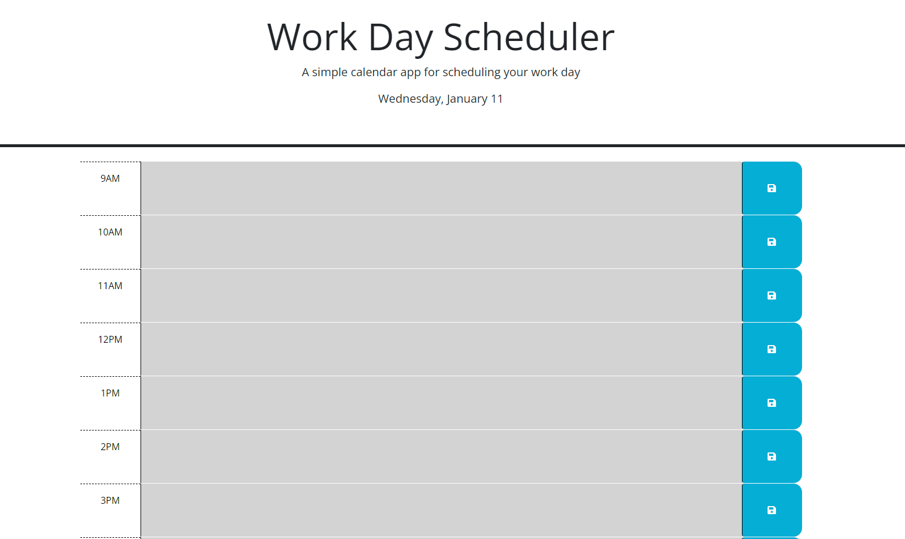

# day-planner

## Purpose

This day planner was designed to give the user a dynamic, easy to read view of their day. functionality right in the browser that most people work in every day avoids the hassle of keeping a paper schedule 

## Usage
The day will be diplayed at the top of the page, and color coding gives the user an extra visual layer to quickly make sense of their plans. Users can enter information into the various time blocks and local storage will save it for later. 

```md
    
    ```
[https://github.com/AlexNash91/day-planner]
[https://alexnash91.github.io/day-planner/]


